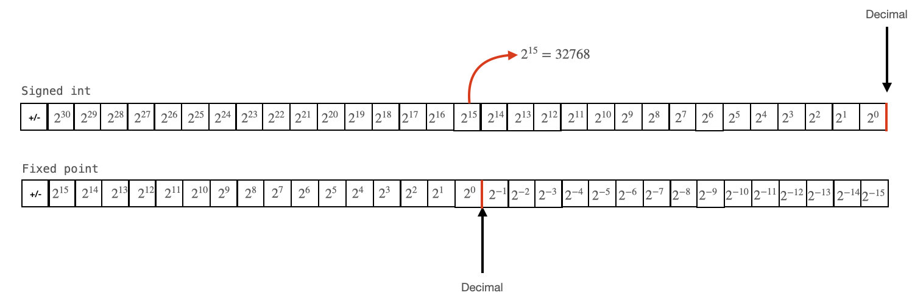

<details open>
<summary> Summary </summary>
* Intodution To OOP [~1]
* 


# Introduction To OOP:

The C++ cames with a very dynamic consept which is The Object Orionted Programming is a smallest definition
is the consept of creation of objects; instance of classes that act like a bleuprints defining the structure
and behavior of these objects. OOP emphasizes consepts like encapsulation, inheritance, polymorphism and 
abstraction.

To descover what's really is this OOP we should first know that is an Object and to do that lets know now that is a primitive date types.

## Primitive Data Types :

A primitive Data Types serve to store A single simple value like : byte, Int, Char, Float ...
Those data types were more that enough for simple programs at the beginning of the programation
but with the developement and the programs being more complicated those Primitive data types where not suffisant for those new programs.

we need to group data for an effitiant use i can't use just character i need to use a string and not just strings i need to use multiple strings as a group and this what we called an array which is a group a multiple values of the same data types like : <br>

An Array of Characters :
```
char ArrayOfChar[] = {"Othmane", "Amine", "Bannana"};
```

An Array of Integers:

```
int ArrayOfInt[] = {123, 5, 33};
```

> we solve the problem know we can use a multiple values as group Is that enough ?? <br>
> What if i need to group Ineger 5 and A string "Mouse" and use it as a data type 

We can't do that now because and as i said before An Array is collection of values of the same Data types so We can't 

> And What we should do know ?

In C comes the consept of Structure to helps us to use multiple data types in one single collection like this :
```
Struct Cluster {
        char Name[];
        char Mode[];
        int NumberOfPosts;
        bool state;
        int position;
}
```
> but I need to add to add some funtions to that struct can we do that In c ?

No we can't do that becuase that C doesn't support tha OOP that we are talking about and that's what C++ cames for to sole and to intoduce The new Data types Class
Class helps us to assemble :

- multiple values 
- with different data types
- and group them with functions

like this :
```
class Car {
    Public :
        char color[];
        int MasSpeed;
        char name[];
        void    ft_announce(); // to announe itself
}
```

> [!Note]
> We can Declare A function inside a struct in cpp with the new consept but it still a Difference between A struct and A class in cpp keep in mind that i used Public inside this class exemple And it has its importance we will check it after in section [^1]

and from that class we can create an instance of that class that act like a family and from that family we have objects that represent members of this family each one of them has its caracteristics and cames from this family.

### And This is The answer of what is an Object


## Encapsulation

## Abstraction

## Polymorphism

## Inheritance


## what happed when we move from an integer representation to a fixed point representation


GitHub Copilot: The decision to use fixed-point representation is often a trade-off between range and precision. 

In a 32-bit integer, you indeed have a range of about +-2^31. When you decide to use 16 bits for the fractional part in a fixed-point representation, you're effectively reducing the range to about +-2^15 (not 2^16, because one bit is used for the sign), but you're gaining the ability to represent fractions.

The benefit of this approach is that you can now represent numbers with fractions, which you couldn't do with a plain integer. This can be very useful in certain applications, like graphics, audio processing, or any kind of computation that requires fractional numbers but doesn't need the full range of a 32-bit integer.

The downside, as you pointed out, is that you're reducing the range of numbers you can represent. If you need to represent very large or very small numbers, fixed-point might not be the best choice.

In the end, whether to use fixed-point or not depends on the specific requirements of your application. If you need to represent fractions and don't need a large range, fixed-point can be a good choice. If you need a large range and don't need to represent fractions, a plain integer might be better. If you need both a large range and the ability to represent fractions, you might need to use a floating-point type, despite its higher computational cost.


GitHub Copilot: The CPU processes data in binary format and doesn't inherently understand the concept of a decimal point. When we talk about fixed-point numbers, the "decimal point" is a concept we impose for our understanding and usage. 

When you store a fixed-point number in memory, it's stored as a binary integer. The CPU doesn't know where the decimal point is supposed to be; it just sees a binary integer. 

For example, if you have a 16-bit fixed-point number with 1 integer bit and 15 fractional bits, and you want to represent the number 1.5, you would store it as `0000000000000001.1000000000000000`. But the CPU just sees this as the 16-bit integer `00000000000000011000000000000000`, which is equal to 2^15 + 2^14 = 49152 in decimal.

When you perform operations on fixed-point numbers, you need to manually account for the decimal point. For example, when you multiply two fixed-point numbers, you need to shift the result to align the decimal point correctly. The CPU doesn't do this for you; it just performs the multiplication as if the numbers were integers.

This is one of the reasons why fixed-point arithmetic can be more complex than integer arithmetic. You need to keep track of where the decimal point is and make sure to handle it correctly in your calculations.





