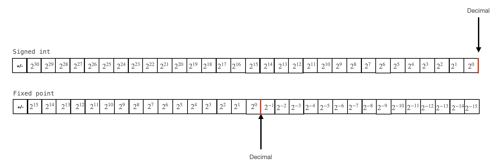
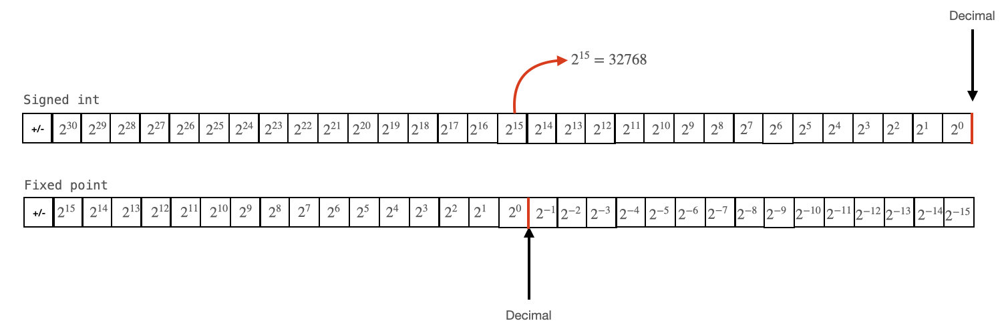

## what happed when we move from an integer representation to a fixed point representation

GitHub Copilot: The decision to use fixed-point representation is often a trade-off between range and precision. 

In a 32-bit integer, you indeed have a range of about +-2^31. When you decide to use 16 bits for the fractional part in a fixed-point representation, you're effectively reducing the range to about +-2^15 (not 2^16, because one bit is used for the sign), but you're gaining the ability to represent fractions.

The benefit of this approach is that you can now represent numbers with fractions, which you couldn't do with a plain integer. This can be very useful in certain applications, like graphics, audio processing, or any kind of computation that requires fractional numbers but doesn't need the full range of a 32-bit integer.

The downside, as you pointed out, is that you're reducing the range of numbers you can represent. If you need to represent very large or very small numbers, fixed-point might not be the best choice.

In the end, whether to use fixed-point or not depends on the specific requirements of your application. If you need to represent fractions and don't need a large range, fixed-point can be a good choice. If you need a large range and don't need to represent fractions, a plain integer might be better. If you need both a large range and the ability to represent fractions, you might need to use a floating-point type, despite its higher computational cost.

GitHub Copilot: The CPU processes data in binary format and doesn't inherently understand the concept of a decimal point. When we talk about fixed-point numbers, the "decimal point" is a concept we impose for our understanding and usage. 

When you store a fixed-point number in memory, it's stored as a binary integer. The CPU doesn't know where the decimal point is supposed to be; it just sees a binary integer. 

For example, if you have a 16-bit fixed-point number with 1 integer bit and 15 fractional bits, and you want to represent the number 1.5, you would store it as `0000000000000001.1000000000000000`. But the CPU just sees this as the 16-bit integer `00000000000000011000000000000000`, which is equal to 2^15 + 2^14 = 49152 in decimal.

When you perform operations on fixed-point numbers, you need to manually account for the decimal point. For example, when you multiply two fixed-point numbers, you need to shift the result to align the decimal point correctly. The CPU doesn't do this for you; it just performs the multiplication as if the numbers were integers.

This is one of the reasons why fixed-point arithmetic can be more complex than integer arithmetic. You need to keep track of where the decimal point is and make sure to handle it correctly in your calculations.

